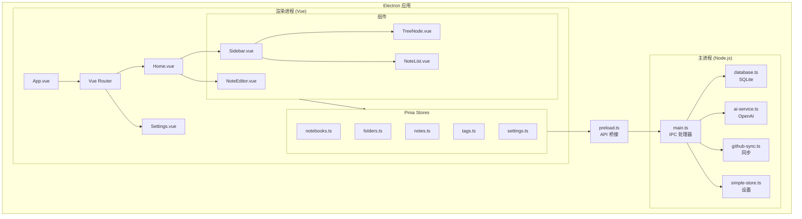
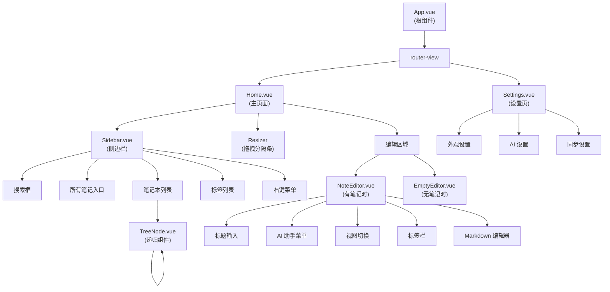
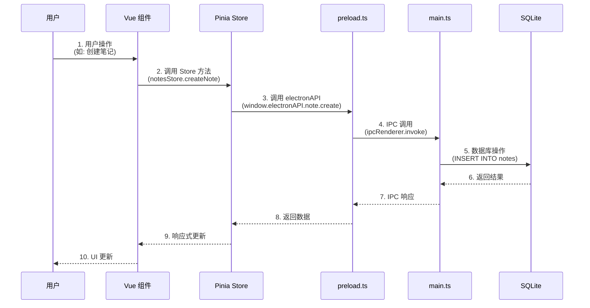
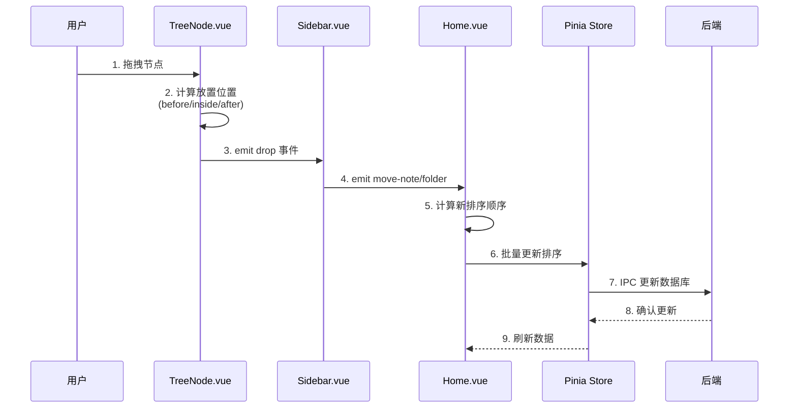
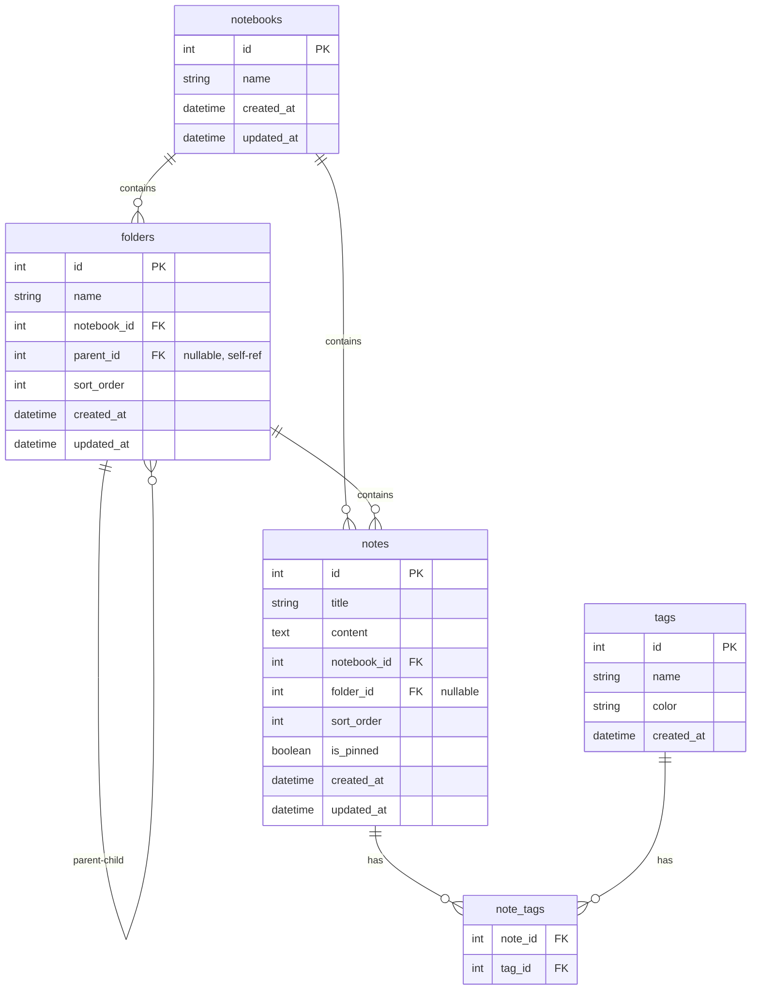

# AI 笔记助手 - 架构文档

> 本文档描述项目的整体架构、组件关系和数据流向，便于后期维护和理解。

## 目录

- [技术栈](#技术栈)
- [项目结构](#项目结构)
- [整体架构图](#整体架构图)
- [组件层级关系](#组件层级关系)
- [数据流向](#数据流向)
- [核心模块说明](#核心模块说明)
- [IPC 通信接口](#ipc-通信接口)
- [数据库设计](#数据库设计)

---

## 技术栈

| 层级 | 技术 | 说明 |
|------|------|------|
| **桌面框架** | Electron | 跨平台桌面应用 |
| **前端框架** | Vue 3 + TypeScript | 响应式 UI |
| **状态管理** | Pinia | Vue 官方状态管理 |
| **路由** | Vue Router | SPA 路由 |
| **样式** | SCSS | CSS 预处理器 |
| **构建工具** | Vite | 快速构建 |
| **数据库** | SQLite (better-sqlite3) | 本地数据持久化 |
| **Markdown** | marked + highlight.js | 编辑与预览 |
| **AI 集成** | OpenAI API | AI 辅助功能 |
| **云同步** | GitHub API | 笔记同步 |

---

## 项目结构

```
├── electron/                    # Electron 主进程
│   ├── main.ts                 # 主进程入口，IPC 处理器
│   ├── preload.ts              # 预加载脚本，API 桥接
│   ├── database.ts             # SQLite 数据库操作
│   ├── ai-service.ts           # OpenAI 集成服务
│   ├── github-sync.ts          # GitHub 同步功能
│   └── simple-store.ts         # 键值存储（设置）
│
├── src/                         # Vue 渲染进程
│   ├── main.ts                 # Vue 应用入口
│   ├── App.vue                 # 根组件
│   ├── components/             # 组件
│   │   ├── Sidebar.vue         # 侧边栏
│   │   ├── TreeNode.vue        # 树节点（递归）
│   │   ├── NoteEditor.vue      # 笔记编辑器
│   │   ├── NoteList.vue        # 笔记列表
│   │   ├── NoteItem.vue        # 笔记项
│   │   └── EmptyEditor.vue     # 空状态
│   ├── views/                  # 页面
│   │   ├── Home.vue            # 主页面
│   │   └── Settings.vue        # 设置页
│   ├── stores/                 # Pinia 状态
│   │   ├── notebooks.ts        # 笔记本
│   │   ├── folders.ts          # 文件夹
│   │   ├── notes.ts            # 笔记
│   │   ├── tags.ts             # 标签
│   │   └── settings.ts         # 设置
│   ├── router/                 # 路由配置
│   └── styles/                 # 全局样式
```

---

## 整体架构图



---

## 组件层级关系



---

## 数据流向



### 拖拽排序数据流



---

## 核心模块说明

### 1. 主进程 (electron/)

| 文件 | 职责 | 关键函数 |
|------|------|----------|
| `main.ts` | 窗口管理、IPC 处理 | `createWindow()`, IPC handlers |
| `database.ts` | SQLite CRUD | `initDatabase()`, `getDb()` |
| `ai-service.ts` | OpenAI 调用 | `summarize()`, `generateTags()`, `polish()` |
| `github-sync.ts` | GitHub 同步 | `sync()`, `push()`, `pull()` |
| `preload.ts` | API 暴露 | `contextBridge.exposeInMainWorld()` |

### 2. 状态管理 (src/stores/)

| Store | 管理内容 | 主要 Actions |
|-------|----------|--------------|
| `notebooks.ts` | 笔记本 | `fetchNotebooks()`, `createNotebook()`, `deleteNotebook()` |
| `folders.ts` | 文件夹 | `fetchFolders()`, `createFolder()`, `moveFolder()` |
| `notes.ts` | 笔记 | `fetchNotes()`, `createNote()`, `updateNote()`, `moveNote()` |
| `tags.ts` | 标签 | `fetchTags()`, `createTag()`, `addTagToNote()` |
| `settings.ts` | 设置 | `loadSettings()`, `updateSettings()` |

### 3. 组件 (src/components/)

| 组件 | 职责 | Props | Emits |
|------|------|-------|-------|
| `Sidebar.vue` | 侧边栏导航 | - | `select-note`, `create-note`, `move-note`, `move-folder` |
| `TreeNode.vue` | 递归树节点 | `node`, `level`, `type` | `select`, `drop`, `context-menu` |
| `NoteEditor.vue` | 笔记编辑 | `note` | `update`, `delete` |
| `NoteList.vue` | 笔记列表 | `notes` | `select` |

---

## IPC 通信接口

### 笔记相关

| Channel | 方向 | 参数 | 返回值 |
|---------|------|------|--------|
| `note:create` | Renderer → Main | `{title, content, notebook_id, folder_id}` | `Note` |
| `note:update` | Renderer → Main | `{id, title?, content?, ...}` | `Note` |
| `note:delete` | Renderer → Main | `{id}` | `boolean` |
| `note:getAll` | Renderer → Main | `{notebook_id?, folder_id?}` | `Note[]` |
| `note:updateSortOrder` | Renderer → Main | `{id, sort_order, folder_id?}` | `boolean` |

### 文件夹相关

| Channel | 方向 | 参数 | 返回值 |
|---------|------|------|--------|
| `folder:create` | Renderer → Main | `{name, notebook_id, parent_id?}` | `Folder` |
| `folder:update` | Renderer → Main | `{id, name?, parent_id?}` | `Folder` |
| `folder:delete` | Renderer → Main | `{id}` | `boolean` |
| `folder:getAll` | Renderer → Main | `{notebook_id}` | `Folder[]` |
| `folder:updateSortOrder` | Renderer → Main | `{id, sort_order, parent_id?}` | `boolean` |

### AI 相关

| Channel | 方向 | 参数 | 返回值 |
|---------|------|------|--------|
| `ai:summarize` | Renderer → Main | `{content}` | `string` |
| `ai:generateTags` | Renderer → Main | `{content}` | `string[]` |
| `ai:polish` | Renderer → Main | `{content}` | `string` |
| `ai:expand` | Renderer → Main | `{content}` | `string` |
| `ai:translate` | Renderer → Main | `{content, targetLang}` | `string` |

---

## 数据库设计



### 表结构说明

| 表名 | 说明 | 关键字段 |
|------|------|----------|
| `notebooks` | 笔记本 | `id`, `name` |
| `folders` | 文件夹 | `id`, `name`, `notebook_id`, `parent_id`, `sort_order` |
| `notes` | 笔记 | `id`, `title`, `content`, `notebook_id`, `folder_id`, `sort_order`, `is_pinned` |
| `tags` | 标签 | `id`, `name`, `color` |
| `note_tags` | 笔记-标签关联 | `note_id`, `tag_id` |

---

## 关键业务逻辑

### 1. 拖拽排序算法

```
当拖拽节点到目标位置时：
1. 判断放置位置 (before/inside/after)
2. 如果是 inside：
   - 将节点移动到目标文件夹内
3. 如果是 before/after：
   - 获取目标位置的同级所有节点
   - 计算新的 sort_order 值
   - 批量更新所有受影响节点的 sort_order
```

### 2. 递归删除文件夹

```
删除文件夹时：
1. 递归获取所有子文件夹 ID
2. 删除所有子文件夹下的笔记标签关联
3. 删除所有子文件夹下的笔记
4. 删除所有子文件夹
5. 删除目标文件夹
```

### 3. AI 功能调用流程

```
1. 用户在编辑器中选择 AI 功能
2. 获取当前笔记内容
3. 通过 IPC 调用 ai-service
4. ai-service 调用 OpenAI API
5. 返回结果并更新笔记内容
```

---

## 开发指南

### 添加新组件

1. 在 `src/components/` 创建 `.vue` 文件
2. 在父组件中导入并注册
3. 如需状态管理，在对应 Store 中添加

### 添加新 IPC 接口

1. 在 `electron/main.ts` 添加 `ipcMain.handle()`
2. 在 `electron/preload.ts` 的 `electronAPI` 中暴露
3. 在 Store 中调用 `window.electronAPI.xxx()`

### 添加新数据表

1. 在 `electron/database.ts` 的 `initDatabase()` 中添加建表语句
2. 创建对应的 Store 文件
3. 添加相关 IPC 接口

---

*文档生成时间: 2024-12-24*
