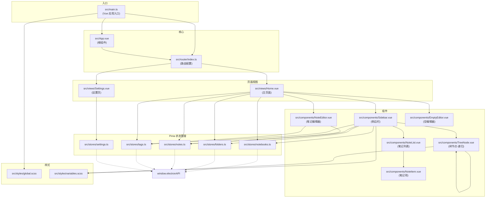
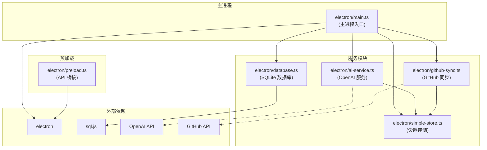
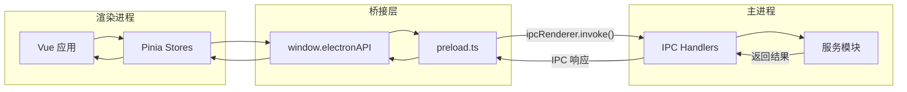
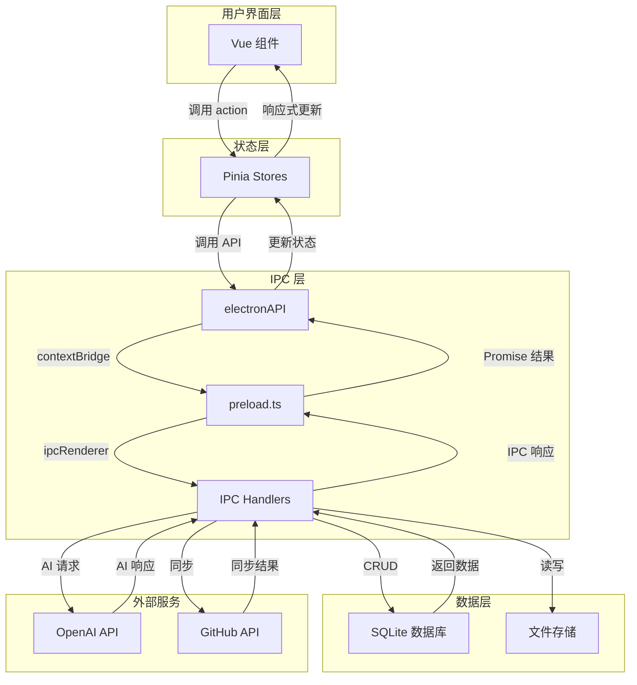
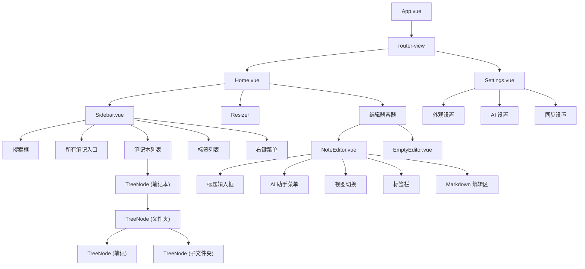
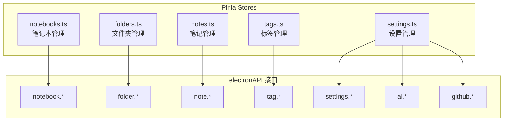

# 模块依赖图

> 本文档展示项目的模块依赖关系，使用 Mermaid 图表可视化。

## 前端模块依赖 (Vue/TypeScript)

## 后端模块依赖 (Electron/Node.js)

## IPC 通信依赖

## 数据流依赖

## 组件树结构

## Store 依赖关系

---

## 如何阅读此图

1. **箭头方向**: 表示依赖方向，A → B 表示 A 依赖 B
2. **虚线箭头**: 表示异步调用或外部依赖
3. **子图**: 将相关模块分组，便于理解层次结构
4. **颜色**: 不同颜色区分不同类型的模块

## 在线查看

将 Mermaid 代码复制到以下工具可在线查看：
- [Mermaid Live Editor](https://mermaid.live/)
- [GitHub](直接在 GitHub 上查看 .md 文件会自动渲染)
- VS Code 安装 "Markdown Preview Mermaid Support" 插件

---

*生成时间: 2024-12-24*
